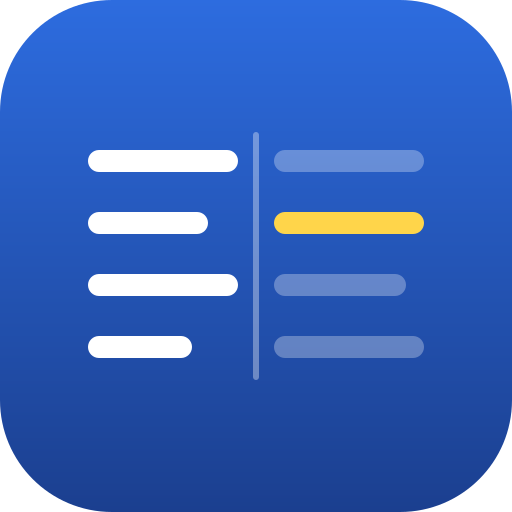

# 瞬間英作文

Google スプレッドシートで「左に日本語・右に英語」を並べて、左を読んで即英語にする——あの練習を、そのまま iPhone と MacBook で気持ちよくやるためのアプリです。

練習モードもスコアもタイマーもありません。**表と、英語を隠す機能だけ**です。

上のタブで **瞬間英作文** と **パラフレ帳** を行き来できます。最後に開いていたほうを覚えています。



## できること（瞬間英作文）

- **スプレッドシートと同じ2列表示** — 左に日本語、右に英語。iPhone の縦画面でも2列のまま崩れません。
- **英語を隠す** — 行をタップ（クリック）すると、その行だけ答えが出ます。上のボタンで全部まとめて隠す／出すも可能。
- **隠し方を選べる** — ぼかす／塗りつぶす／空白にする の3種類。
- **逆向き** — 英語を読んで日本語にする向きにも切り替えられます。
- **アプリの中で1文ずつ足せる** — 思いついた文をその場で追加。追加 → 欄が空になる → また追加、と続けて入れられます。
- **セットも自分で作れる** — 名前を決めて空のセットを新規作成し、そこに1文ずつ溜めていけます。表を用意しなくても始められます。
- **自分のデータを読み込める** — Google スプレッドシートで2列を選んでコピーし、貼り付けるだけ。TSV / CSV 両対応。
- **音声は自動** — 読み上げは文字から合成するので、追加した文にも何もしなくても音声が付きます。設定で「表示したら自動で読み上げる」もオンにできます。
- **収録例文 360 文** — be動詞・一般動詞・時制・助動詞・完了/受動態・使える文型 の6セット。
- **★チェック** — つまずいた文に印を付けて、あとで★だけ表示。
- **1文ずつ直せる** — 行の ✎ から、その1文の日本語・英語・メモを書き換えられます。収録の 360 文も直せて、**元データは書き換えません**。「元に戻す」でいつでも収録の文へ戻せます。
- **読み上げ** — 英語を音声で確認できます（対応ブラウザのみ）。
- **検索・シャッフル・文字サイズ変更・ダークモード自動対応**
- **My Dictionary から受け取れる** — 別アプリ（My Dictionary）で 📤 を押した文が、上に「取り込む」として届きます。
- **iPhone と MacBook で揃う** — 自作セット・足した文・書き換えた文・★・パラフレ帳を、端末どうしで同期できます。
- **オフラインで動く** — 一度開けば電波がなくても使えます。ホーム画面に追加すればアプリのように起動します。

## My Dictionary から送る

単語帳アプリ **My Dictionary** で覚えた表現を、そのまま瞬間英作文の出題に回せます。

1. My Dictionary で項目の 📤 を押す
2. 「英文」「日本語」「型（任意）」を確かめて **送る**
3. 瞬間英作文を開くと上に「**「My Dictionary」から 2 件届いています**」と出るので **取り込む**

取り込むと「My Dictionary」というセットに入り、いつもどおり日本語を見て英作文する形になります。
型を入れておくと、答えを表示したときにメモとして一緒に出ます。

**英文と日本語の両方がそろっているものだけ送れます。** 瞬間英作文は「日本語 → 英文」で出すので、
`late` のような単語だけだと出題できないからです。My Dictionary 側の送信画面で、例文があれば
自動で埋まり、無ければその場で文の形に直せます。一度送った項目には「送信済み」が付くので、
同じものを何度も送らずに済みます（間違って二度送っても、同じ文は取り込みのときに省かれます）。

### 仕組み

2 つのアプリは同じ GitHub Pages のドメインにパス違いで置かれています
（`…github.io/dictionary-22/` と `…github.io/sunkan-333/`）。localStorage はオリジン単位なので、
`sunkan:inbox` という 1 つのキーを受け渡し場所にできます。サーバーもアカウントも要りません。

ただし **iPhone では、ホーム画面に追加したアプリとブラウザで保存領域が分かれます。**
片方をホーム画面から、もう片方を Safari から開いていると、localStorage は共有されません。
そのため My Dictionary 側には「**瞬間英作文で開く**」という受け渡し用のボタンがあり、
送ったカードを URL に載せて開きます。URL なら保存領域が分かれていても必ず届きます。
どちらの道で来たものも、同じ文は取り込みのときに省かれるので、二重に並ぶことはありません。

いずれにしても **同じ端末の中だけ**の受け渡しで、機種をまたぐことはありません。

## iPhone と MacBook で揃える

自作セット・足した文・★・パラフレ帳を、端末どうしで揃えられます。**⚙ 設定 → 同期の設定** から。
やり方は 2 つあり、**どちらも「どちらの端末で足したものも消えない」**のは同じです。

### かんたんに渡す（登録なし）

片方の端末で「**リンクを作ってコピー**」を押し、メモ・メッセージ・AirDrop などで自分に送って、
**もう片方で開くだけ**です。アカウントもトークンも要りません。

文が多くてリンクに収まらないときは「**ファイルに書き出す**」→ AirDrop などで送って、
向こうで「**ファイルを読み込む**」。こちらは大きさの制限がありません。

**ホーム画面に追加したアプリが相手のときは、リンクを開けません**（アドレス欄が無いため）。
そのときは渡す側で「**リンクをコピー**」して、受け取る側の同じ画面にある
「**貼り付けて受け取る**」に貼り付けてください。My Dictionary の 🔗 で作ったリンクも、
同じところで受け取れます。

**思い出したときに手で渡す形**で、放っておいて勝手に揃うわけではありません。
自動で揃えたい場合は、下の GitHub を使うほうを設定してください。

> このアプリはサーバーを持たない（GitHub Pages に置いた HTML だけの）作りなので、
> **どこかに登録しないかぎり、裏で勝手に同期する仕組みは作れません。**
> データを預ける先が無いためです。iCloud も、Safari のブックマークやパスワードは同期しますが、
> **アプリのデータ（localStorage）は同期しません。**

### 放っておいても揃うようにする（GitHub を使う）

最初に一度だけ登録すれば、あとは開くたびに自動で揃います。GitHub の「シークレット Gist」
（**URL を知っている人だけが見られる場所**）を置き場として使います。
**完全に非公開というわけではない**点にご注意ください。

**用意するのは 1 回だけ**です。そのあとは、どの端末・どのアプリでも何もしなくて構いません。

#### 1 回目（どれか 1 つのアプリで）

1. [GitHub でトークンを作る](https://github.com/settings/tokens/new)。Note は何でもよく、
   権限（scope）は **gist** だけにチェックすれば足ります
2. ⚙ 設定 → 同期の設定 → トークンを貼って「**保存先を新しく作る**」
   （ここで自動同期も一緒に入ります）
3. 「**つなぐリンクをコピー**」

#### 2 つ目から（トークンの入力は要りません）

コピーした**つなぐリンクを貼り付けるだけ**です。

- 瞬間英作文 … ⚙ 設定 → 同期の設定 → 「貼り付けて受け取る」
- My Dictionary … メニュー → 同期の設定 → 「つなぐリンクを貼り付ける」

ホーム画面に追加したアプリにはアドレス欄が無く、リンクを開けません。貼り付けなら届きます。
**つなぐリンクにはトークンが入っているので、人に渡さないでください。**

つないだあとは、My Dictionary で 📤 送ったカードも、そのままメインの瞬間英作文に出ます。

### 決まりごと（どちらのやり方でも同じ）

- **どちらの端末で足したものも消えません。** 両方から拾って 1 つにまとめます
  （時刻で丸ごと勝ち負けを付けると、片方がしばらくオフラインだった間の追加が消えるため）
- **消したものは、もう片方でも消えます。** 消した記録を持ち回ります。消したあとに同じ文を
  足し直せば、そちらが生きます
- **同期しないもの**: 隠し方・文字サイズ・逆向きなどの設定（端末ごとの好みのため）と、収録の 360 文
- **失敗したときは手元のデータに手を付けません。** 向こうが読めないときは、空と解釈せずに
  同期そのものを止めます（相手にしか無いものを塗りつぶさないため）
- トークンは**その端末の中だけ**に保存され、GitHub 以外へは送りません

My Dictionary にも同じ仕組みの同期があります（メニュー → 同期の設定）。**トークンは使い回せます。**
Gist ID も同じもので構いません（中では別のファイルに分けて置きます）。

## パラフレ帳

同じ意味を別の言い方で言えるように、言い換えをためておくモードです。中身は空から始まります。

- **ジャンルがいちばん上** — 検索欄のように打ち込んで絞り込み、無ければその場で「作る」。太字のチップで並び、タップで切り替わります。ジャンルを消してもパラフレは残り、「ジャンルなし」に移ります。
- **1 枚の形** — 見出しの枠に元の英文を大きく、その下に日本語の意味を小さく。枠の外に言い換えを **4 つまで**、少し小さい英文と意味で並べます。
- **言い換えを隠す** — ボタンを押すと言い換えがぼやけ、見出しをタップした札だけ出ます。見出しだけ見て、自分で言い換えを作ってから答え合わせできます。
- **検索** — 英文でも日本語でも、見出し・言い換え・ジャンル名をまとめて探せます。
- **★と「★だけ表示」** — 覚えきれていない札に印を付けて、あとで★だけ拾えます。
- **並べ替えとシャッフル** — 追加順 / 新しい順 / A → Z / ジャンル順。⇅ で順番をばらせます（順番で覚えてしまうのを防ぐため）。
- **瞬間英作文へ送る** — 📤 でその1枚を、📋 の「まとめて送る」で表示中のぶんを、瞬間英作文のセットに流し込めます。「パラフレ帳（ジャンル名）」というセットができ、同じ日本語に対する言い換えが1文ずつ並ぶので、そのまま口に出す練習になります。元のパラフレは残ります。
- **表でまとめて出し入れ** — 📋 から、ジャンル / 見出しの英文 / 見出しの意味 / 言い換え（英文・意味）×4 の 11 列で読み込み・書き出し。スプレッドシートで整えてから貼り付けられ、バックアップにもなります。
- **読み上げ** — 🔈 で見出しから言い換えまで続けて読み上げます（対応ブラウザのみ）。
- **✎ で編集、🗑 で削除** — いつでも直せます。

### 使い方

1. 上のタブで「パラフレ帳」を開く
2. いちばん上の欄にジャンル名を入れて「＋ 作る」（ジャンルなしのままでも使えます）
3. 「＋ パラフレを追加」で、見出しの英文と意味、言い換えを 4 つまで入れる

保存はブラウザの中（localStorage）だけです。瞬間英作文のセットとは別に保存されるので、どちらを触ってももう一方には影響しません（「送る」を使ったときだけ、パラフレの中身が瞬間英作文側にコピーされます）。

### 表の形（📋 の読み込み・書き出し）

1 行が 1 枚、列は左から次の順です。言い換えが 2 つだけなら、残りの列は空のままでかまいません。

| ジャンル | 見出しの英文 | 見出しの意味 | 言い換え1の英文 | 言い換え1の意味 | … | 言い換え4の意味 |
| --- | --- | --- | --- | --- | --- | --- |
| 日常会話 | Could you say that again? | もう一度言ってもらえますか。 | Would you mind repeating that? | もう一度お願いできますか。 | … | |

見出し行が付いていれば自動で外します。同じ見出しの英文がすでにあるものは飛ばします。

## 使い方

### そのまま開く

`index.html` をブラウザで開くだけで動きます。ビルド不要・依存パッケージなしの素の HTML/CSS/JS です。

ローカルで動かすなら（サービスワーカーを効かせるには `file://` ではなく HTTP が必要です）:

```sh
python3 -m http.server 8000
# → http://localhost:8000
```

### iPhone のホーム画面に追加する

1. Safari でアプリを開く
2. 共有ボタン → 「ホーム画面に追加」
3. アイコンから起動すると、アドレスバーなしの全画面で立ち上がります

### 自分のセットを作る

1. 右上の「＋追加」を開く
2. 下の「新しいセットを作る」に名前を入れて「作る」

空のセットができてすぐ開くので、そのまま1文目から入れていけます。作ったセットは「自作セット」に並び、いらなくなったら「表からまとめて読み込む」の中の一覧から削除できます。

### 1文ずつ足す

1. 右上の「＋追加」（または一覧のいちばん下の「＋ 文を追加」）を開く
2. 日本語と英語を入れて「追加する」

入れるとすぐ一覧の末尾に並びます。欄が空になるので、そのまま次の文を続けて入れられます。追加した文には番号の横に ＋ が付き、その行の 🗑 でいつでも消せます（収録の文は消えません）。

**音声の用意は要りません。** 読み上げは文字から合成しているので、足した文もそのまま 🔈 で読み上げられます。

### 1文だけ直す

1. 行をタップして開く（★が付いている行・いま見ている行でもかまいません）
2. 行の右に出る **✎** を押す
3. 日本語・英語・メモを直して「保存する」

収録の 360 文も直せます。**元のデータは書き換えません。** 直した内容だけを別に覚えて、
表示するときに上から当てているので、ダイアログの「**元に戻す**」でいつでも収録の文へ戻せます。

直しても★は外れません（★は文そのものではなく行に付いています）。書き換えた内容も
「元に戻す」も、同期していれば他の端末に伝わります。

自分で足した文には「元に戻す」は出ません（戻す先の元の文がないためです）。

### スプレッドシートからまとめて入れる

1. Google スプレッドシートで、日本語の列と英語の列（2列）を選んでコピー
2. 「＋追加」→ 下の「表からまとめて読み込む」を開く
3. セット名を入れて、そのまま貼り付け → 「読み込む」

3列目まで入れておくと、メモとして扱われます。データはブラウザの中（localStorage）にだけ保存されます。

## キーボード操作（MacBook）

| キー | 動作 |
| --- | --- |
| `↑` `↓` | 行を移動 |
| `Space` / `Enter` | いまの行の英語を表示／非表示 |
| `A` | 全部表示／全部非表示 |
| `S` | いまの行に★を付ける／外す |
| `/` | 検索へ |
| `Esc` | 検索を消す／ダイアログを閉じる |
| `←` `→` | モードを切り替え（上のタブにフォーカスがあるとき） |

`↑↓` などの行の操作は瞬間英作文のときだけ効きます。パラフレ帳を開いている間はキーを取りません。

## 中身

```
index.html                  画面の構造（DOM の定義）
assets/style.css            見た目すべて（iPhone / MacBook / ライト・ダーク）
assets/data.js              収録例文 360 文
assets/app.js               瞬間英作文の動作すべて
assets/paraphrase.js        パラフレ帳の動作すべて＋モード切り替え
assets/inbox.js             受信箱（別アプリから届いたカードの取り込み）
assets/sync.js              端末どうしの同期（GitHub の Gist 経由）
assets/speech.js            読み上げ（端末ごとの癖はここに閉じ込めてある）
manifest.webmanifest, sw.js ホーム画面追加とオフライン対応
CONTRACT.md                 ファイル間の取り決め
```

フレームワークもビルドツールも使っていません。`assets/data.js` を書き換えれば収録例文をそのまま差し替えられます。

## 公開する

`main` に push すると GitHub Pages に自動で公開されます（リポジトリの Settings → Pages で Source を **GitHub Actions** にしておいてください）。
